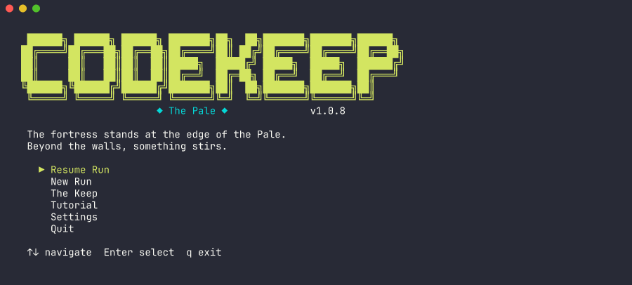
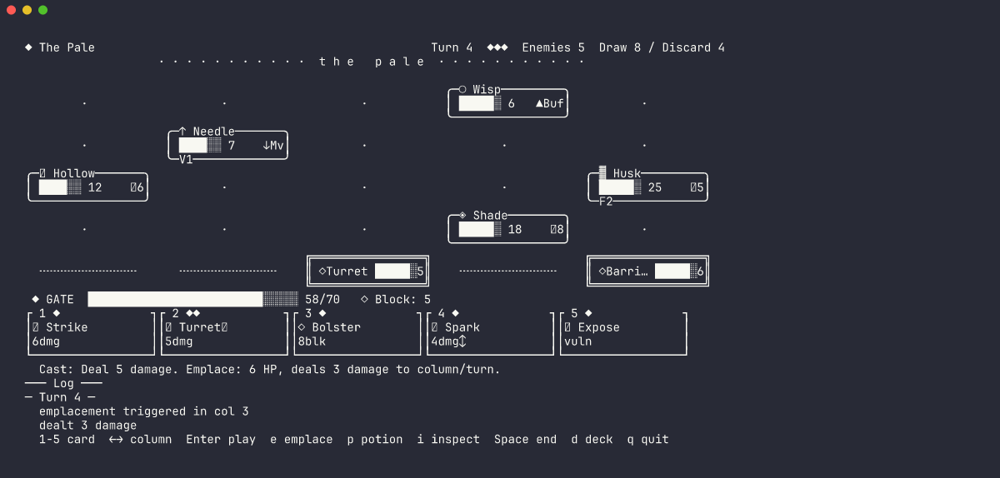
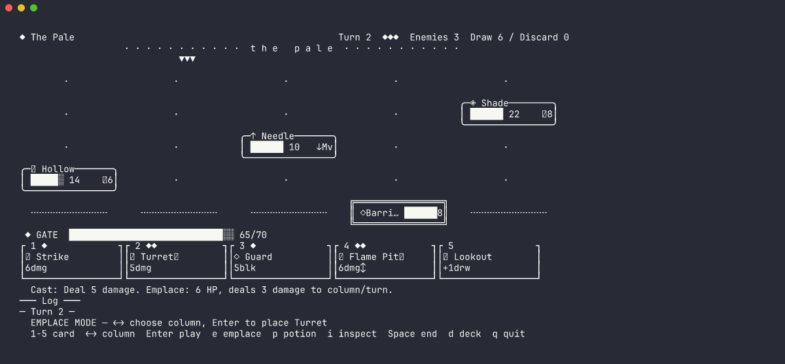
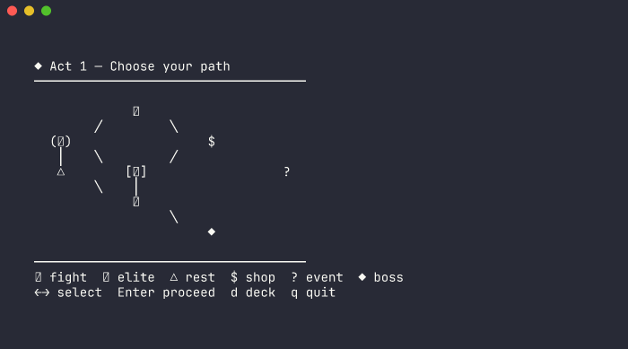
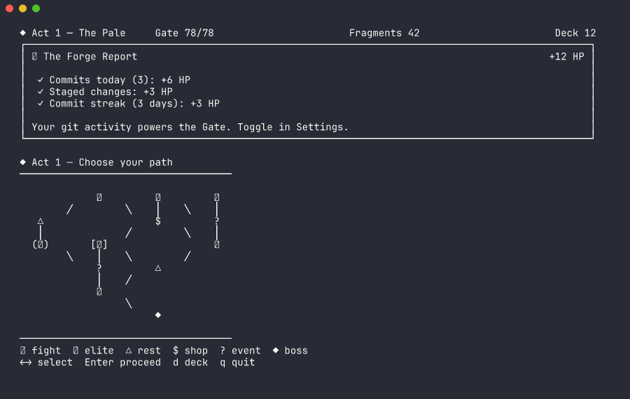

# CodeKeep: The Pale

A deck-building tactical roguelike played in your terminal.

Build a deck. Defend the Gate. Push back the Pale.



## Play Now

```bash
npx codekeep
```

No download. No account. No telemetry. Just a terminal (108×24 or larger).

**Alternative installs:**

```bash
# Global install
npm install -g codekeep && codekeep

# From source
git clone https://github.com/tooyipjee/codekeep.git
cd codekeep && pnpm install && pnpm play
```

## What Is It?

CodeKeep is a Slay the Spire-inspired roguelike that runs entirely in your terminal. Navigate procedural maps, fight enemies on a 5-column tactical grid, build your deck with 70+ unique cards, and uncover a layered narrative across dozens of runs.



### Core Loop

1. **Draw** — 5 cards each turn from your deck
2. **Play** — Spend Resolve to cast cards (damage, block, heal) or **emplace** them as permanent column structures
3. **End Turn** — Enemies advance, attack, and execute their telegraphed intents
4. **Win** — Kill all enemies before they destroy your Gate

### The Emplace Mechanic

Every emplace card is a choice: burn it for the instant effect, or invest it as a permanent structure that fires every turn. Turrets deal damage. Barricades grant block. Beacons heal your Gate. Choosing between immediate value and long-term infrastructure is where the interesting decisions live.



### Features

- **70+ cards** across 4 categories: Armament, Fortification, Edict, Wild
- **Emplacements** — Dual-use cards that can be placed as persistent structures on the 5-column grid
- **13 enemy types** + 3 multi-phase bosses (The Suture, The Archivist, The Pale Itself)
- **3-act campaign** with procedural branching maps, shops, events, rest sites
- **The Keep** — Persistent hub with 5 structures to upgrade and 5 NPCs with evolving relationships
- **15 Ascension levels** — Stacking difficulty modifiers for replayability
- **20 relics** — Passive bonuses from bosses and elites
- **5 potions** — Consumable tactical options
- **Difficulty settings** — Easy, Normal, Hard
- **Layered narrative** — Inscryption-style story that unfolds across 50+ runs
- **15 lore entries** revealing the mystery of the Pale
- **Save/resume** — Autosaves on every action; crash recovery on next launch
- **Local-first** — No backend, no account, no telemetry



### Git Integration (Optional)

Run CodeKeep from a git repo and it detects your activity, granting bonus Gate HP at the start of each run:

| Activity | Bonus |
|----------|-------|
| Commits today | +2 HP each (max +10) |
| Staged changes | +3 HP |
| Unstaged changes | +2 HP |
| Commit streak | +1 HP per consecutive day (max +5) |
| **Total cap** | **+20 HP** |

Bonuses re-scan when you return to the map screen. If your activity increases mid-run, your Gate HP goes up. Toggle on/off in Settings. Reads only local git metadata — nothing leaves your machine.



### Controls

| Key | Action |
|-----|--------|
| `1-9` | Select card |
| `←→` | Target column |
| `Enter` | Play selected card |
| `Space` | End turn |
| `e` | Toggle emplace mode |
| `i` | Inspect enemies |
| `p` | Use potion |
| `d` | View deck |
| `q` | Quit / back |

## Development

```bash
pnpm install
pnpm build
pnpm test
pnpm play      # launch the game
pnpm dev       # watch mode
```

### Architecture

```
packages/
  shared/     — Types, constants, narrative data. Zero dependencies.
  server/     — Pure game engine. No UI. All functions testable.
  cli/        — Ink (React for CLI) TUI. Thin render layer.
```

All game logic lives in `server`. The CLI is a thin rendering + input layer. The engine is pure and deterministic — same seed + same plays = identical outcome.

### Testing

```bash
pnpm test                                  # all tests
pnpm --filter @codekeep/server test        # engine only
pnpm --filter codekeep test                # CLI only
```

## License

MIT
